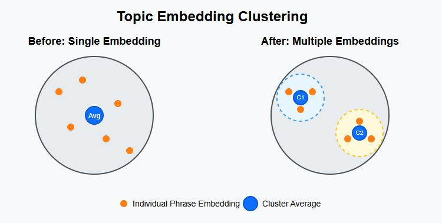

# 🏷️ Fast Topic Analysis

A tool for analyzing text against predefined topics using average weight embeddings and cosine similarity.


#### Maintained by
<a href="https://www.equilllabs.com">
  
</a>

<br>
<br>

## Overview

Fast Topic Analysis is a powerful tool for identifying topic matches in text with high precision. It uses embedding-based semantic analysis with an advanced clustering approach to detect nuanced topic variations.

Key features:
- **Multiple Embeddings Per Topic**: Creates several weighted average embeddings for each topic instead of a single representation, capturing different semantic variations
- **Embedding Clustering**: Groups similar phrases within topics to form coherent semantic clusters
- **Cohesion Scoring**: Measures how tightly grouped the embeddings are within each cluster, providing insight into cluster quality
- **Configurable Precision**: Offers preset configurations for different use cases (high precision, balanced, performance)
- **Fast Processing**: Optimized for efficient text analysis with minimal processing time

The project has two main .js files:
1. A generator (`generate.js`) that creates topic embeddings from training data
2. An interactive demo (`run-demo.js`) that analyzes text against these topic embeddings

### New Feature: Embedding Clustering and Cohesion Score

The tool now supports **clustering** of embeddings within each


## Setup

Install dependencies:

```bash
npm install
```

## Usage

### Generating Topic Embeddings

```bash
node generate.js
```

This will:
- Clean the `data/topic_embeddings` directory
- Process training data from `data/training_data.jsonl`
- Generate embeddings for each topic defined in `labels-config.js`
- Cluster similar embeddings within each topic
- Save multiple embeddings per topic as JSON files in `data/topic_embeddings/`

#### Clustering Configuration

You can customize the clustering behavior using command-line arguments:

```bash
# Use a predefined configuration preset
node generate.js --preset high-precision

# Customize individual parameters
node generate.js --similarity-threshold 0.92 --max-clusters 3
```

Available presets:
- `high-precision`: Optimized for maximum accuracy with more granular clusters
  - `CLUSTERING_SIMILARITY_THRESHOLD=0.95`
  - `CLUSTERING_MIN_CLUSTER_SIZE=3`
  - `CLUSTERING_MAX_CLUSTERS=8`
- `balanced`: Default settings for good precision and performance
  - `CLUSTERING_SIMILARITY_THRESHOLD=0.9`
  - `CLUSTERING_MIN_CLUSTER_SIZE=5`
  - `CLUSTERING_MAX_CLUSTERS=5`
- `performance`: Optimized for speed with fewer clusters
  - `CLUSTERING_SIMILARITY_THRESHOLD=0.85`
  - `CLUSTERING_MIN_CLUSTER_SIZE=10`
  - `CLUSTERING_MAX_CLUSTERS=3`
- `legacy`: Disables clustering for backward compatibility
  - `ENABLE_CLUSTERING=false`

Command-line options for `generate.js`:
- `--preset, -p <name>`: Use a predefined configuration preset
- `--enable-clustering <bool>`: Enable or disable clustering (true/false)
- `--similarity-threshold <num>`: Set similarity threshold for clustering (0-1)
- `--min-cluster-size <num>`: Set minimum cluster size
- `--max-clusters <num>`: Set maximum number of clusters per topic
- `--help`: Show help message

For more options, run:
```bash
node generate.js --help
```

### Running Analysis

```bash
node run-demo.js
```

The test runner provides an interactive interface to:
1. Choose logging verbosity
2. Optionally show matched sentences if verbose logging is disabled
3. Select a test message file to analyze

You can also specify a test message directly:
```bash
node run-demo.js 1
node run-demo.js message-1.txt
```

Command-line options for `run-demo.js`:
- `--verbose, -v`: Enable verbose logging
- `--quiet, -q`: Disable verbose logging
- `--show-matches, -s`: Show matched sentences
- `--hide-matches, -h`: Hide matched sentences
- `--help`: Show help message

Configuration preferences (last used file, verbosity, etc.) are automatically saved in `run-demo-config.json`.

#### 🚨 First Run Model Download

The first time a model is used (e.g. `generate.js` or `run-demo.js`), it will be downloaded and cached to the directory speciifed in `.env`. All subsequent runs will be fast as the model will be loaded from the cache.


### Output

The analysis will show:
- Similarity scores between the test text and each topic cluster
- Which specific cluster matched each sentence
- Execution time
- Total comparisons made
- Number of matches found
- Model information

## File Structure

```
├── data/
│   ├── training_data.jsonl          # Training data
│   └── topic_embeddings/            # Generated embeddings
├── test-messages/                   # Test files
├── modules/
│   ├── embedding.js                 # Embedding functions
│   ├── similarity.js                # Similarity calculation
│   └── clusterEmbeddings.js         # Clustering functionality
├── test/
│   ├── cluster-test.js              # Unit tests for clustering
│   └── demo-clustering.js           # clustering demo test
├── generate.js                      # Embedding generator
├── run-demo.js                      # Test runner
└── labels-config.js                 # Topic definitions
```

## Customizing

### Model Settings

Change the model settings in `.env` to use different embedding models and configurations:
```env
# Model and precision
ONNX_EMBEDDING_MODEL="Xenova/all-MiniLM-L12-v2"
ONNX_EMBEDDING_MODEL_PRECISION=fp32

# Available Models and their configurations:
# | Model                                        | Precision      | Size                   | Requires Prefix | Data Prefix     | Search Prefix |
# | -------------------------------------------- | -------------- | ---------------------- | --------------- | --------------- | ------------- |
# | Xenova/all-MiniLM-L6-v2                      | fp32, fp16, q8 | 90 MB, 45 MB, 23 MB    | false           | null            | null          |
# | Xenova/all-MiniLM-L12-v2                     | fp32, fp16, q8 | 133 MB, 67 MB, 34 MB   | false           | null            | null          |
# | Xenova/paraphrase-multilingual-MiniLM-L12-v2 | fp32, fp16, q8 | 470 MB, 235 MB, 118 MB | false           | null            | null          |
# | nomic-ai/modernbert-embed-base               | fp32, fp16, q8 | 568 MB, 284 MB, 146 MB | true            | search_document | search_query  |
```

### Clustering Configuration

Configure clustering behavior in `.env`:

| Variable | Description | Default | Example |
|----------|-------------|---------|---------|
| `ENABLE_CLUSTERING` | Enable or disable clustering functionality | `true` | `ENABLE_CLUSTERING=true` |
| `CLUSTERING_SIMILARITY_THRESHOLD` | Threshold for considering embeddings similar (0-1) | `0.9` | `CLUSTERING_SIMILARITY_THRESHOLD=0.85` |
| `CLUSTERING_MIN_CLUSTER_SIZE` | Minimum number of phrases per cluster | `5` | `CLUSTERING_MIN_CLUSTER_SIZE=3` |
| `CLUSTERING_MAX_CLUSTERS` | Maximum number of clusters per topic | `5` | `CLUSTERING_MAX_CLUSTERS=8` |

Example configuration:
```env
# Clustering Configuration
ENABLE_CLUSTERING=true
CLUSTERING_SIMILARITY_THRESHOLD=0.9
CLUSTERING_MIN_CLUSTER_SIZE=5
CLUSTERING_MAX_CLUSTERS=5
```

### Other Customizations

- Change the thresholds defined in `labels-config.js` per topic to change the similarity score that triggers a match.
- Add more test messages to the `test-messages` directory to test against.
- Add more training data to `data/training_data.jsonl` to improve the topic embeddings.

### Task Instruction Prefixes

Some models require specific prefixes to optimize their performance for different tasks. When a model has `Requires Prefix: true`, you must use the appropriate prefix:

- `Data Prefix`: Used when generating embeddings from training data
- `Search Prefix`: Used when generating embeddings for search/query text

For example, `nomic-ai/modernbert-embed-base` requires:
- `search_document` prefix for training data
- `search_query` prefix for search queries

Models with `Requires Prefix: false` will ignore any prefix settings.

### Training Data

The training data is a JSONL file that contains the training data. Each line is a JSON object with the following fields:
- `text`: The text to be analyzed
- `label`: The label of the topic

```jsonl
{"text": "amphibians, croaks, wetlands, camouflage, metamorphosis", "label": "frogs"}
{"text": "jumping, ponds, tadpoles, moist skin, diverse habitats", "label": "frogs"}
{"text": "waterfowl, quacking, ponds, waddling, migration", "label": "ducks"}
{"text": "feathers, webbed feet, lakes, nesting, foraging", "label": "ducks"}
{"text": "dabbling, flocks, wetlands, bills, swimming", "label": "ducks"}
```

The training data is used to generate the topic embeddings. The more training data you have, the better the topic embeddings will be.
The labels to be used when generating the topic embeddings are defined in `labels-config.js`.

## How Clustering Works

The clustering algorithm groups similar embeddings based on cosine similarity:

1. Calculate embeddings for all phrases in a topic
2. Initialize the first cluster with the first embedding
3. For each remaining embedding:
   - Calculate average similarity to each existing cluster
   - If similarity exceeds the threshold, add to the most similar cluster
   - If no cluster is similar enough and we haven't reached max clusters, create a new cluster
   - If we've reached max clusters, add to the most similar cluster regardless of threshold
4. Process clusters that are smaller than the minimum size:
   - If the combined small clusters are still smaller than the minimum and we have valid clusters, distribute them to the most similar valid clusters
   - Otherwise, create a new "miscellaneous" cluster containing all small cluster items
5. Calculate the average embedding for each final cluster
6. Calculate a cohesion score for each cluster (average similarity between all embeddings and the centroid)

This approach ensures that all phrase embeddings are represented in the final clusters while maintaining semantic coherence within each cluster. The algorithm balances precision and performance by limiting the number of clusters while ensuring that each cluster contains sufficiently similar embeddings.

### Cohesion Score

Each cluster includes a cohesion score that measures how tightly grouped the embeddings are within the cluster. The cohesion score is calculated as the average cosine similarity between each embedding in the cluster and the cluster's centroid.

- A higher cohesion score (closer to 1.0) indicates a more tightly grouped cluster with very similar embeddings
- A lower cohesion score indicates a more diverse cluster with embeddings that are less similar to each other

The cohesion score can be useful for:
- Evaluating the quality of clusters
- Identifying topics that might benefit from more training data
- Understanding why certain matches might be less reliable than others

## 📺 Video Demo
[](https://www.youtube.com/watch?v=SsPKA2Sy1pE)
